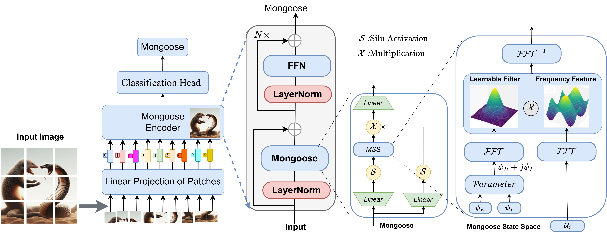
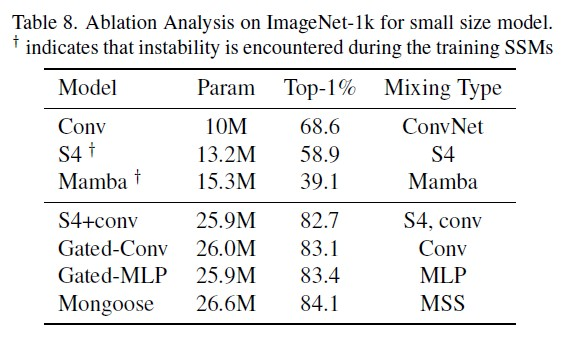
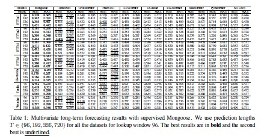
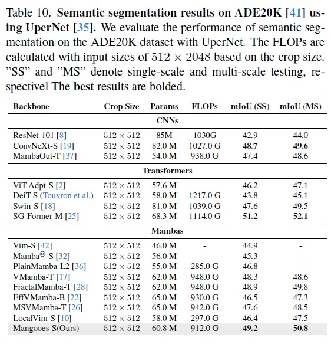
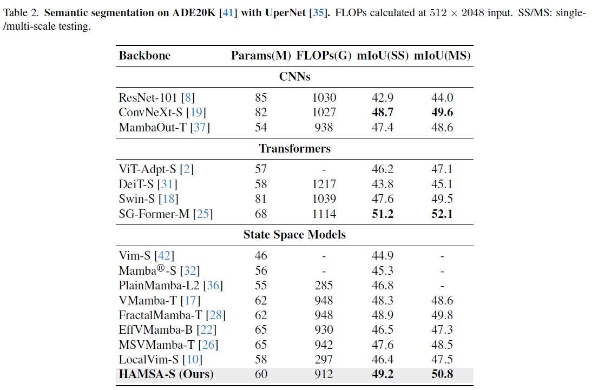
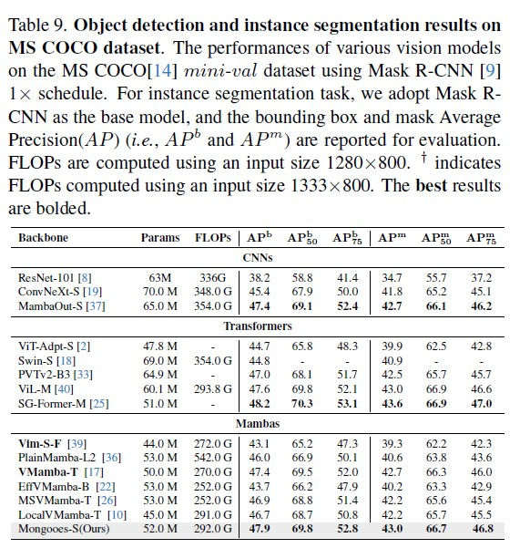
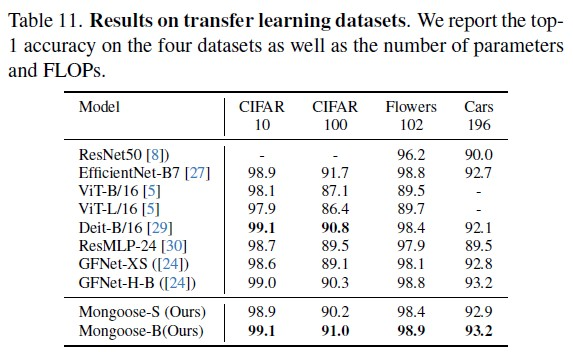
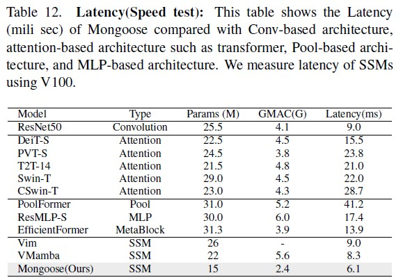

# Mongoose:  Do We Need a Scanner for Vision Mamba?





**Abstract**  
Self-attention, the backbone of transformers, faces challenges with quadratic complexity in long-context sequences, affecting training and inference throughput. State Space Models (SSMs) are an alternative architecture to address this issue. Mamba and its variants (Vim, VMamba, SiMBA) are well-known SSMs for vision tasks. However, these existing methods introduce computational overhead due to specialized scanning techniques. To address these issues, we propose Mongoose, a simplified SSM that eliminates scanning mechanisms and uses a learnable spectral gating network. Mongoose reduces complexity, training significantly faster 1.5X faster than other SSMs (Vim, VMamba, and SiMBA) on V100 GPUs. It achieves state-of-the-art SSM results on the ImageNet dataset, reaching 85.7\% accuracy on a large network size, matching top transformers.

**SOTA Comparison on ImageNet 1K**


**Ablation Analysis of Mongoose**


**SOTA for Multi-Variate Time Series Forecasting**



**Performance of Mongoose: Semantic Segmentation**



**Performance of Mongoose: Object Detection**



**Performance of Mongoose: Transfer Learning**


**Latency Analysis**


## Requirement:

```
* PyTorch 1.10.0+
* Python3.8
* CUDA 10.1+
* [timm](https://github.com/rwightman/pytorch-image-models)==0.4.5
* [tlt](https://github.com/zihangJiang/TokenLabeling)==0.1.0
* pyyaml
* apex-amp
```


## Data Preparation

Download and extract ImageNet images from http://image-net.org/. The directory structure should be

```

│ILSVRC2012/
├──train/
│  ├── n01440764
│  │   ├── n01440764_10026.JPEG
│  │   ├── n01440764_10027.JPEG
│  │   ├── ......
│  ├── ......
├──val/
│  ├── n01440764
│  │   ├── ILSVRC2012_val_00000293.JPEG
│  │   ├── ILSVRC2012_val_00002138.JPEG
│  │   ├── ......
│  ├── ......

```


## Training  Mongoose

We can train Mongoose with and without token-label. Following is with token-label. If you want without token-label, just comment it. 

## Train Mongoose small model with  token-label

```
python3 -m torch.distributed.launch \
   --nproc_per_node=8 \
   --nnodes=1 \
   --node_rank=0 \
   --master_addr="localhost" \
   --master_port=12346 \
   --use_env main.py --config configs/mongoose/mongoose_s.py --data-path ../../../../dataset/Image_net/imagenet --epochs 310 --batch-size 128 --drop-path 0.05 --weight-decay 0.05 --lr 1e-3 --num_workers 24\
   --token-label --token-label-size 7 --token-label-data ../../../../dataset/Image_net/imagenet_efficientnet_l2_sz475_top5/
```


## Train Mongoose Base model

```
python3 -m torch.distributed.launch \
   --nproc_per_node=8 \
   --nnodes=1 \
   --node_rank=0 \
   --master_addr="localhost" \
   --master_port=12346 \
   --use_env main.py --config configs/mongoose/mongoose_b.py --data-path ../../../../dataset/Image_net/imagenet --epochs 310 --batch-size 128 --drop-path 0.05 --weight-decay 0.05 --lr 1e-3 --num_workers 24\
   --token-label --token-label-size 7 --token-label-data ../../../../dataset/Image_net/imagenet_efficientnet_l2_sz475_top5/
```

## Train Mongoose Large model

```
python3 -m torch.distributed.launch \
   --nproc_per_node=8 \
   --nnodes=1 \
   --node_rank=0 \
   --master_addr="localhost" \
   --master_port=12346 \
   --use_env main.py --config configs/mongoose/mongoose_l.py --data-path ../../../../dataset/Image_net/imagenet --epochs 310 --batch-size 128 --drop-path 0.05 --weight-decay 0.05 --lr 1e-3 --num_workers 24\
   --token-label --token-label-size 7 --token-label-data ../../../../dataset/Image_net/imagenet_efficientnet_l2_sz475_top5/
```


